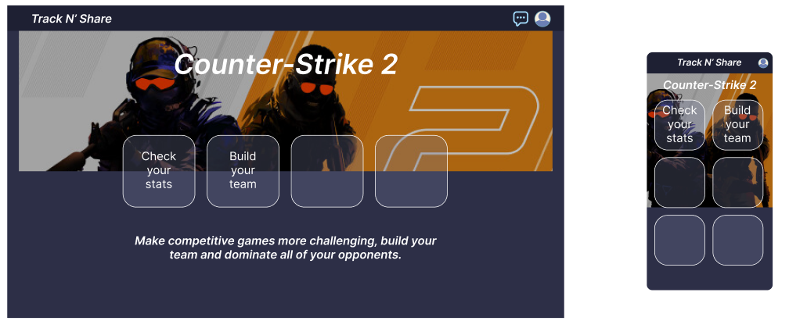

# Track'N Share — Front UI Reference

## Objectif du fichier

Ce fichier sert de référence visuelle pour le développement du front-end de Track'N Share.

Claude Code doit s'en servir pour comprendre l'ambiance graphique attendue, surtout pour la landing page, le style général et le responsive desktop/mobile.

## Référence visuelle Figma

La maquette de référence est stockée ici :

```txt
docs/drive-export/03-Design-UX-UI/Maquettes/landing-hero-figma-reference.png
```

Image de référence :



Cette image montre une première direction graphique pour la landing page Track'N Share.

## Intention graphique

L'interface doit donner une impression de plateforme gaming compétitive, moderne et sombre.

Mots-clés :

- gaming ;
- compétition ;
- statistiques ;
- équipe ;
- leaderboard ;
- performance ;
- PWA ;
- responsive ;
- sombre ;
- dynamique.

## Ambiance générale

La maquette montre :

- un fond principal bleu nuit / gris sombre ;
- une barre supérieure compacte ;
- le nom `Track N' Share` en haut à gauche ;
- des icônes d'accès rapide en haut à droite ;
- un grand visuel hero autour d'un jeu compétitif ;
- un titre fort au centre du hero ;
- des cartes d'action semi-transparentes ;
- une phrase d'accroche sous le hero ;
- une version mobile compacte en grille.

## Structure desktop observée

La version desktop présente :

```txt
Header
Hero image large
Titre du jeu
Cartes d'action
Slogan
```

Éléments visibles :

- header sombre ;
- logo / nom du projet ;
- icône chat ;
- icône profil ;
- image hero large ;
- titre de jeu ;
- cartes d'action ;
- slogan centré.

Cartes visibles sur la maquette :

```txt
Check your stats
Build your team
```

## Structure mobile observée

La version mobile reprend les mêmes éléments mais en format compact :

```txt
Header compact
Titre projet
Icône profil
Titre jeu
Grille de cartes 2 colonnes
Image hero en arrière-plan partiel
```

Points importants :

- largeur réduite ;
- header compact ;
- cartes en grille 2 colonnes ;
- boutons assez grands pour mobile ;
- texte court ;
- image utilisée comme fond ou illustration ;
- interface lisible malgré l'espace réduit.

## Page concernée

Route recommandée :

```txt
/
```

Nom de page recommandé :

```txt
LandingPage
```

Fichier possible :

```txt
apps/web/src/pages/LandingPage.tsx
```

Structure plus propre possible :

```txt
apps/web/src/features/landing/
  components/
    LandingHeader.tsx
    HeroSection.tsx
    ActionCard.tsx
  LandingPage.tsx
```

## Sections minimales de la landing page

La landing page MVP doit contenir :

1. Header
2. Hero gaming
3. Cartes d'action principales
4. Slogan
5. Boutons ou liens vers les pages importantes

## Header

Le header doit contenir :

- le nom du projet : `Track N' Share` ;
- une icône chat ou message ;
- une icône profil ou connexion ;
- une hauteur compacte ;
- un fond sombre.

Desktop :

- logo à gauche ;
- icônes à droite.

Mobile :

- logo à gauche ;
- icône profil à droite ;
- éviter un menu complexe au début.

## Hero

Le hero doit être visuel et impactant.

Il peut contenir :

- une image de fond gaming ;
- un overlay sombre pour garder le texte lisible ;
- un titre fort ;
- des cartes d'action ;
- un slogan court.

Attention :

- ne pas dépendre d'une image externe non fiable ;
- ne pas utiliser une image sous droits non maîtrisés dans une version finale publique ;
- pour le MVP étudiant, une image placeholder ou libre peut être utilisée ;
- prévoir un remplacement facile de l'image.

## Cartes d'action

Cartes MVP recommandées :

```txt
Check your stats
Build your team
Climb the leaderboard
Chat with your team
```

Comportement recommandé :

| Carte | Destination si connecté | Destination si non connecté |
|---|---|---|
| Check your stats | `/dashboard` | `/login` |
| Build your team | `/teams` | `/login` |
| Climb the leaderboard | `/leaderboard` | `/leaderboard` |
| Chat with your team | `/teams` | `/login` |

## Style des cartes

Les cartes doivent s'inspirer de la maquette :

- fond semi-transparent ;
- bordure claire ;
- coins arrondis ;
- texte blanc ;
- effet hover léger ;
- taille tactile suffisante ;
- grille responsive.

Style Tailwind possible :

```txt
rounded-2xl
border border-white/70
bg-slate-900/45
backdrop-blur-sm
text-white
shadow-lg
hover:bg-white/10
transition
```

## Palette visuelle suggérée

Couleurs proches de la maquette :

```txt
Fond principal : #2B2D46
Header : #17182B
Texte principal : #FFFFFF
Texte secondaire : #E5E7EB
Bordures : rgba(255,255,255,0.7)
Accent orange : #F59E0B
Accent bleu : #6366F1
```

À éviter :

- fond blanc dominant ;
- couleurs trop pastel ;
- interface trop corporate ;
- manque de contraste ;
- trop d'effets visuels inutiles.

## Typographie

Style attendu :

- titre hero grand, blanc, italic ou semi-bold ;
- slogan en italic ;
- textes de cartes courts ;
- hiérarchie claire.

Exemple :

```txt
Titre desktop : text-4xl à text-6xl
Titre mobile : text-xl à text-2xl
Slogan : text-base à text-lg
Cartes : text-sm à text-base
```

## Responsive

La landing page doit être mobile-first.

### Mobile

- header compact ;
- hero moins haut ;
- grille 2 colonnes ;
- cartes carrées ou presque ;
- textes courts ;
- pas de débordement horizontal ;
- boutons faciles à toucher.

### Desktop

- hero large ;
- image en bandeau ;
- cartes alignées horizontalement ou en grille ;
- slogan centré ;
- marges généreuses.

## PWA

La landing page doit rester compatible PWA :

- chargement rapide ;
- image optimisée ;
- layout stable ;
- pas de dépendance lourde inutile ;
- responsive propre ;
- boutons assez grands pour mobile.

## Accessibilité

À respecter :

- contraste suffisant ;
- texte lisible sur l'image ;
- overlay si nécessaire ;
- `alt` sur les images ;
- boutons avec labels clairs ;
- navigation clavier possible ;
- ne pas transmettre l'information uniquement par la couleur.

## Règles pour Claude Code

Claude Code peut créer ou modifier :

```txt
apps/web/src/pages/LandingPage.tsx
apps/web/src/features/landing/components/HeroSection.tsx
apps/web/src/features/landing/components/ActionCard.tsx
apps/web/src/features/landing/components/LandingHeader.tsx
```

Claude Code doit éviter :

- de créer une landing trop complexe ;
- de développer des fonctionnalités back-end pour cette tâche ;
- de modifier l'authentification sans demande ;
- d'ajouter des librairies inutiles ;
- de casser la structure du monorepo ;
- de copier exactement une image non libre ;
- de rendre la landing dépendante d'une API.

## Prompt recommandé pour générer la landing page

```txt
Crée la landing page Track'N Share en t'inspirant de :

- docs/00-AI-Context/front-ui-reference.md
- docs/drive-export/03-Design-UX-UI/Maquettes/landing-hero-figma-reference.png

Respecte la structure actuelle du monorepo :
- front dans apps/web
- React + TypeScript + Vite
- responsive mobile-first
- style sombre gaming
- header compact
- hero avec image ou placeholder
- cartes d'action : Check your stats, Build your team, Climb the leaderboard, Chat with your team

Ne développe pas de fonctionnalités back-end.
Crée seulement l'UI et les routes nécessaires côté front.
```

## Résumé

La landing page doit être :

- sombre ;
- gaming ;
- claire ;
- responsive ;
- visuelle ;
- simple à maintenir ;
- cohérente avec le MVP.

Priorité :

1. Hero visuel.
2. Header compact.
3. Cartes d'action.
4. Responsive mobile.
5. Style proche de la maquette.
6. Code propre.