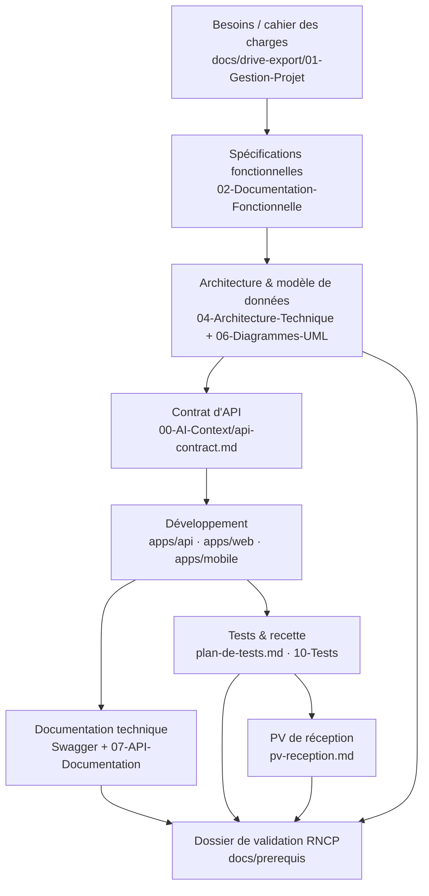
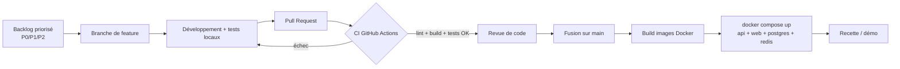
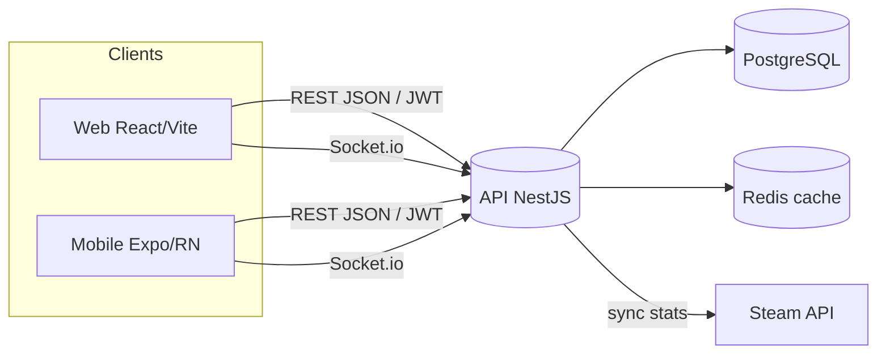

# Diagramme de workflow documentaire & de développement — Track'N Share

> **Livrable RNCP — BC02-3** « Formaliser la circulation des documents (diagramme de workflow) ».
> Date : 2026-07-01. Diagrammes en Mermaid (rendus par GitHub / VS Code).

## 1. Circulation des documents du projet

## 2. Workflow de développement (feature → production)

## 3. Flux de données applicatif (échange d'informations)

## 4. Lecture

Ces diagrammes formalisent trois circulations complémentaires : **documentaire**
(du besoin au dossier de validation), **de développement** (de la feature à la
mise en exploitation via la CI), et **de données** (entre clients, API et
services externes) — couvrant les exigences BC02-3 et éclairant BC04.
